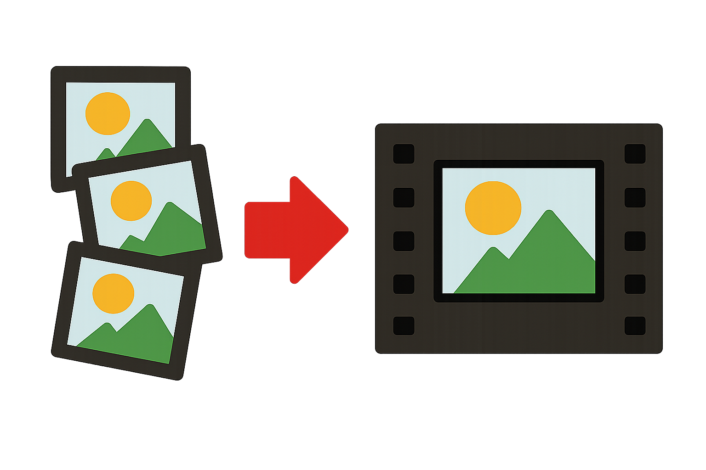

# 📸 Stills-2-Video
*A Simple Client-Side Image Sequence to Video Converter*



Stills-2-Video is a simple, client-side web application for turning your still images into a video, right in your browser! No uploads to a server, no external services.

I built this because i was getting sick of messing around with ffmpeg or fire up something heavy like Premiere Pro or Final Cut Pro everytime I needed to create a video from a sequence of images.

**Disclaimer:** This project is very much a **work-in-progress** and was built with a fair bit of **vibe coding** and experimental exploration. Functionality is pretty limited, but the core idea is there! 

## ✨ Features (Current & Planned)

### Current Capabilities:

*   **Drag & Drop Image Import:** Easily bring your images into the app.
*   **WebM Video Export:** Generate videos in the WebM format directly in your browser.
*   **Client-Side Processing:** All the heavy lifting (image ordering, video encoding) happens locally on your machine.
*   **Simple Image Ordering:** Sorting by filename, date modified, file size, or manual drag-and-drop reordering.

### Planned / Future Ideas:

*   **More Export Options:** Control over frame rate, resolution, and perhaps even alternative video formats (if browser support allows or with a heavy-duty WASM solution).
*   **User Interface Refinements:** Making the experience a little less bad.

## 🚀 Get Started (For Developers)

This project is built with TypeScript, React, Vite, and styled with Tailwind CSS.

1.  **Clone the repository:**
    ```bash
    git clone https://github.com/robrab2000/stills2video.git
    cd stills2video
    ```
2.  **Install dependencies:**
    ```bash
    npm install
    ```
3.  **Start the development server:**
    ```bash
    npm run dev
    ```
    The app should now be running at `http://localhost:5173` (or whatever port Vite chooses).

## 💡 Contribution - Pull Requests Welcome!

As mentioned, this is a "vibe coded" project, and I'm very keen to see how others might want to contribute! If you have ideas, spot bugs, or want to tackle one of the planned features (or suggest new ones!), please don't hesitate to:

1.  **Fork the repository.**
2.  **Create a new branch** (`git checkout -b feature/your-feature-name` or `bugfix/issue-name`).
3.  **Make your changes.**
4.  **Commit your changes** (`git commit -m "feat: Add cool new thing"`).
5.  **Push to your branch** (`git push origin feature/your-feature-name`).
6.  **Open a Pull Request!**

All contributions, no matter how small, are greatly appreciated! Let's build something cool together.

## 📄 License

This project is open source and available under the [MIT License](LICENSE).